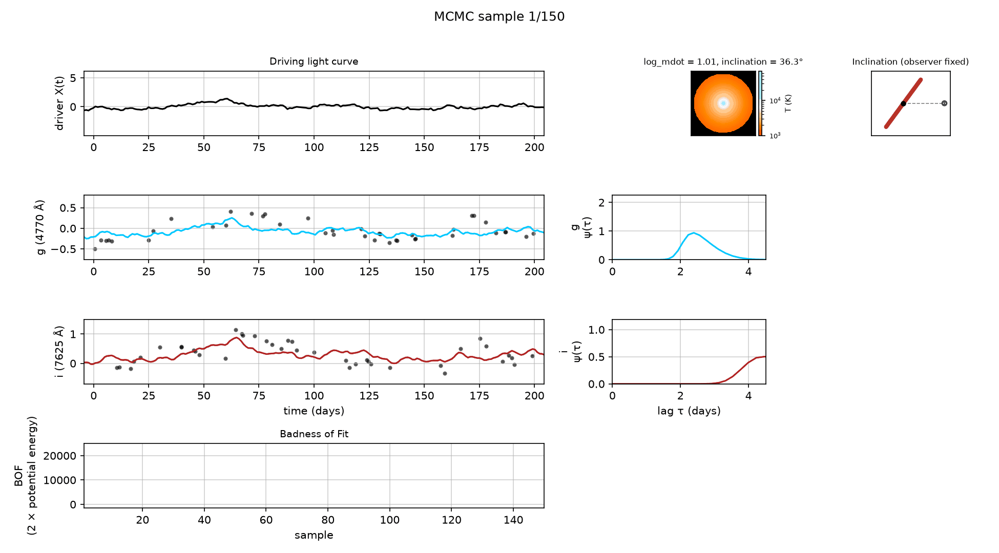

# pycream2

**Bayesian AGN continuum reverberation mapping, in JAX and NumPyro.**

`pycream2` fits multi-band AGN light curves as a delayed, smoothed echo of
an unobserved driving light curve reprocessed by a lamppost-illuminated
accretion disk. It infers the posterior of the disk's parameters
(accretion rate, inclination, temperature profile) together with the driver
itself. **CREAM** stands for **C**ontinuum **R**eprocessing **A**GN
**M**CMC: `pycream2` is the successor to the original CREAM Fortran code and
its Python wrapper [`pycecream`](https://github.com/drds1/pycecream),
rewritten in pure JAX/NumPyro with gradient-based (NUTS) sampling, a fast
direct-solve mode, and no Fortran compiler.



## Install

```bash
pip install pycream2
```

Python 3.10 or newer.

## Quickstart

```python
from pycream2 import EchoFit, generate_synthetic_dataset

data = generate_synthetic_dataset(M_BH=1e8)

ef = EchoFit(M_BH=1e8)                       # black hole mass is fixed, not fitted
for name, d in data["bands"].items():
    ef.add_lightcurve(name, wavelength=d["wavelength"], t=d["t"], y=d["y"], yerr=d["yerr"])
ef.build_grid()

ef.optimise()                                # fast direct solve, no MCMC
ef.fit()                                     # the full posterior (NUTS)
ef.plot_lightcurve_fits()
ef.plot_corner()
```

For real data, add `fit_error_model=True` to each `add_lightcurve` call so
the quoted error bars are rescaled rather than trusted exactly; see the
[fitting guide](fitting_guide.md#fit_error_model-default-false) for why this
matters on real campaigns.

## Where to go next

<div class="grid cards" markdown>

- **[Fitting guide](fitting_guide.md)**: every setting, its default, and
  when to change it.
- **[Thin-disk response function](thin_disk_response.md)**: the physical
  disk response, derived from Starkey, Horne & Villforth (2016).
- **[How the MCMC works](mcmc_implementation.md)**: NUTS, the mass matrix,
  and how it compares with the original CREAM sampler.
- **[Performance and the direct solve](performance_improvements.md)**:
  benchmarks, linear marginalisation and the Laplace approximation.
- **[API reference](api.md)**: every public class and function.

</div>

## Citing pycream2

If you use `pycream2` in published work, please cite:

> Starkey, D. A., Horne, K. & Villforth, C. (2016), *Accretion disc time
> lag distributions: applying CREAM to simulated AGN light curves*, MNRAS,
> 456, 1960. [arXiv:1511.06162](https://arxiv.org/abs/1511.06162)

The repository's [`CITATION.cff`](https://github.com/drds1/pycream2/blob/main/CITATION.cff)
has the machine-readable version, and GitHub's "Cite this repository"
button uses it.
