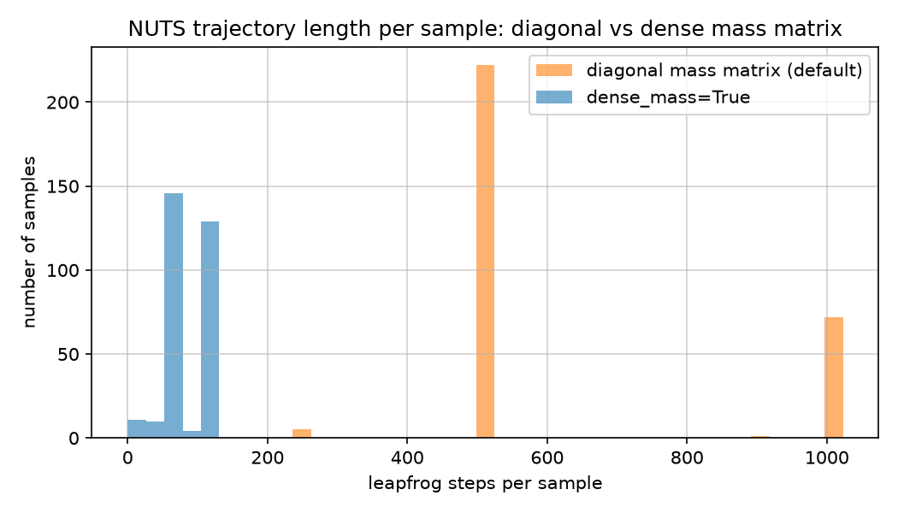

# How the MCMC inference works

`echofit` fits every parameter jointly with NumPyro's **NUTS** (No-U-Turn
Sampler), a self-tuning variant of Hamiltonian Monte Carlo (HMC), run
through JAX. This document works through what that actually means
mechanically, what `dense_mass=True` (CLAUDE.md decision #17) changes and
why, with real before/after charts, and closes with an honest comparison
to the author's original PhD-era CREAM Fortran implementation, since it's
easy to *assume* a modern stack is strictly better without checking what
specifically changed.

## 1. Hamiltonian Monte Carlo, in brief

Plain Metropolis-Hastings proposes a new point by taking a small random
step from the current one and accepting/rejecting it based on how the
posterior density changes. For a model with dozens of correlated
parameters (this one has `log_mdot`, `inclination`, `sigma_drw`, `tau_drw`,
two Fourier coefficients per frequency, and two per band), a *random* step
direction is a bad guess almost every time, so it takes a huge number of
tiny steps to move anywhere useful.

HMC instead borrows an idea from physics: treat the current parameter
values as a "position" `theta`, introduce a fictitious "momentum" `p` for
each one, and simulate the pair moving together under Hamiltonian dynamics
for a while before proposing the endpoint. Because the simulated dynamics
follow the *gradient* of the log-posterior (steepest ascent/descent, not a
random guess), the proposed point can be far from the start and still have
a high acceptance probability. NUTS automates the one manual choice plain
HMC leaves (how long to simulate for) by running the simulation forwards
*and* backwards from the current point, doubling the trajectory length
each time, and stopping automatically once the trajectory starts to
"U-turn" back on itself -- hence the name.

This is why the model is built the way CLAUDE.md's design decisions
describe: the driver is a Fourier series with a closed-form convolution
(decisions #1-#2) specifically so the whole forward model is a plain,
differentiable JAX function end to end. HMC/NUTS is only practical because
JAX can compute the exact gradient of the log-posterior with respect to
every parameter automatically (`jax.grad`), rather than needing a
hand-derived analytic gradient or an expensive finite-difference
approximation for a model this complex.

## 2. The mass matrix, and what `dense_mass=True` changes

The simulated dynamics in section 1 need one more physical quantity: how a
given momentum kick translates into movement in each direction, exactly
like real mass does (a heavier object moves less for the same kick). This
is the **mass matrix**, and NUTS's momentum-sampling and kinetic-energy
term (`p^T M^-1 p / 2`) both depend on it directly.

- **Diagonal mass matrix** (NumPyro's default): one independent scale per
  parameter, estimated from each parameter's own variance during warmup.
  This corrects for parameters being on very different numeric scales
  (`inclination` in tens of degrees vs. `tau_drw` in tens of days), but it
  can only stretch/shrink along the existing coordinate axes.
- **Dense mass matrix** (`dense_mass=True`): the *full* covariance matrix
  across all parameters, estimated during warmup. This can also *rotate*
  the implied step directions to align with correlations between
  parameters, not just rescale each one independently.

If two parameters are correlated in the posterior (forming a tilted,
elongated cloud rather than a round one), a diagonal mass matrix's
"natural" step directions don't match that tilt. NUTS can still reach
every part of the posterior, but only by zigzagging along the correlation
in many small steps before satisfying its U-turn criterion, which is
exactly what a long, expensive trajectory looks like.

### This is a real, measured effect on this model, not a hypothetical

Checked directly on a representative synthetic fit (2 bands, `n_freq=15`,
`n_tau=100`, 800 warmup + 300 samples, single chain, same seed for both
runs): with the default diagonal mass matrix, NUTS spent a mean of **631
leapfrog steps per sample**, clustered right at the `max_tree_depth`
ceiling (`2**10 - 1 = 1023`); with `dense_mass=True`, that dropped to a
mean of **88 steps per sample**, a ~7x reduction, with the underlying
recovery accuracy (`log_mdot`, the well-identified parameter) essentially
unchanged.



The mechanism is visible directly in the posterior itself.
`sigma_drw` (the DRW variability amplitude) and `S_g` (band `g`'s driver
gain, see CLAUDE.md decision #13) are correlated in this fit (`r ~ -0.68`,
checked directly) -- variance in the shared driver amplitude has to be
absorbed by *some* combination of the DRW's own scale and each band's
gain, so the posterior traces out a curved ridge rather than a round blob.
The diagonal mass matrix's implied 1-sigma step ellipse (orange, left) is
axis-aligned and doesn't follow that ridge; the dense mass matrix's
implied ellipse (blue, right) is tilted to match it:


Regenerate both charts (e.g. after a model change that might alter the
posterior geometry) with:

```bash
poetry run python scripts/plot_dense_mass_comparison.py
```

### The real cost: a longer warmup

A dense mass matrix has `O(P^2)` covariance entries to estimate during
warmup instead of `O(P)` variances, so it needs more warmup samples to
adapt reliably. Checked directly: a 200-sample warmup left a real, if
modest, divergence rate (6% in one run); an 800-sample warmup brought that
down substantially, though not perfectly reproducibly across seeds (a
second comparison run at 800 warmup still showed 5%, right at the
threshold `tests/test_recovery.py` itself uses for "trust this fit"). This
is a one-off warmup-phase cost, not a per-sample one, so it doesn't erode
the wall-time win on any run long enough for the sampling phase to
dominate -- but it does mean `dense_mass=True` isn't a strict "free"
win to switch on blindly: check `ef.extra_fields["diverging"]` after a
real run and raise `num_warmup` (or `target_accept_prob`) if the
divergence rate looks high, the same way you'd check for any other NUTS
run.

## 3. JIT compilation

NumPyro traces the whole model function once with `jax.jit` and compiles
it to a single XLA executable; every subsequent leapfrog step (warmup or
sampling) reuses that compiled program with none of the per-call Python
dispatch overhead an eager call would pay. This is why
`scripts/profile_pipeline.py` measures every component's cost *after* a
`jax.jit` warm-up call -- see CLAUDE.md decision #9 for a concrete case
where the eager-vs-jit gap was ~50x, which would badly mislead about where
time actually goes if measured the wrong way. It also means the very first
call in a run pays a real, one-off compilation cost (`profile_pipeline.py`
measures this too, as `nuts_one_off_compile_and_warmup`), separate from
the steady-state per-sample cost that determines how a long run scales.

## 4. Multiple chains

`EchoFit.fit(num_chains=4, chain_method="vectorized")` runs several chains
batched via `jax.vmap` on a single device rather than sequentially one
after another, which is close to "free" extra chains (for Gelman-Rubin
R-hat convergence checking, see `plotting.plot_corner`) when a run is
dominated by fixed per-call overhead rather than raw compute. This is
orthogonal to `dense_mass`: it gets you more *independent* chains cheaply,
it doesn't reduce any one chain's own per-sample cost.

## 5. How this compares to the original CREAM Fortran implementation

Several pieces of this codebase are direct, checked adaptations of ideas
from the author's PhD-era CREAM Fortran code (`cream_f90.f90`), already
documented in CLAUDE.md where they were introduced:

- The precompute-once, interpolate-and-stretch trick behind
  `build_thin_disk_response_table`/`build_thin_disk_response_fast`
  (decision #9) mirrors `cream_f90.f90`'s own `psistore(:,ist)` array.
- The data-anchored prior on `sigma_drw` (decision #13) mirrors the
  Fortran's optional Gaussian prior on `P0` (`sigp0square`/`siglogp0`,
  the `bof4` term).
- The Badness-of-Fit diagnostic (`plot_bof`, decision #11) reproduces
  Starkey, Horne & Villforth (2016) eq. 12, the same quantity CREAM's own
  BOF terms track.

The sampling algorithm itself is a genuinely different comparison, and
this section is now checked directly against `cream_f90.f90`'s own
sampling loop (`mcmcmulti_iteration`) and its covariance-aware proposal
mode (`affine_step`), not a general assumption about "old vs. new".

### The default algorithm: single-site random-scan Metropolis-Hastings

`mcmcmulti_iteration`'s main loop (`do ip_idx=1,NP`) cycles through every
parameter **one at a time** each iteration (optionally in a randomised
order each pass, the "random scan" variant of Metropolis-within-Gibbs, per
the routine's own comment citing
[bayesian-inference.com/mcmcmwg](http://www.bayesian-inference.com/mcmcmwg)),
proposing a symmetric Gaussian random-walk step for that one parameter
alone:

```fortran
p(ip) = p(ip) + rang(0., pscale(ip), iseed)   ! rang = Box-Muller Gaussian deviate
```

and accepting or rejecting it with the standard Metropolis rule:

```fortran
if ( (bofnew < bofold) .or. (exp(-0.5*(bofnew-bofold)/T_ann) > ran3(iseed)) ) then
    ! accept
```

`T_ann` (a simulated-annealing temperature) defaults to `1.0` unless a
separate `cream_anneal.par` file is present to opt into annealing, so by
default this is the textbook Metropolis-Hastings acceptance probability
(BOF is `-2*log(posterior)` up to a constant, the same relationship
CLAUDE.md decision #11 uses for `plot_bof`'s Badness-of-Fit trace). Each
parameter's own proposal width (`pscale(ip)`) is adapted with a simple
doubling-after-a-streak-of-accepts / halving-after-a-streak-of-rejects
rule, a much cruder heuristic than NUTS's dual-averaging step-size
adaptation during warmup.

### A genuine analogue to `dense_mass`: "affine stepping"

The Fortran code also has a second, opt-in proposal mode (`affine_step`),
active only every other iteration and only for parameters named in a
`cream_affine.par` file the user must create. For that named subset, it
estimates their empirical covariance matrix from past samples,
eigendecomposes it (`call jacobi(cov, np, np, eval, evec, nrot)`), and
draws a **joint** Gaussian step aligned with that covariance's principal
axes rather than one parameter at a time:

```fortran
gaus_0_v(ipc) = rang(0., sqrt(eval(ipc)), iseed)          ! step along each eigen-direction
pnew(ipc) = sum(evec(ipc,:) * gaus_0_v(:)) + mean(ipc)    ! rotate back to parameter space
```

This is, conceptually, the same core idea `dense_mass=True` implements for
NUTS: don't just rescale each parameter independently, rotate the proposal
to match the posterior's actual correlation structure. It's a real,
independently-arrived-at precedent for fixing the same kind of problem
`dense_mass` fixes here, just applied to a random-walk Metropolis step
rather than a Hamiltonian trajectory, and manually opt-in for a
hand-picked subset of parameters rather than automatic across every
parameter the way `dense_mass=True` is.

### The difference that remains: gradients

Both mechanisms solve "align the proposal geometry with the posterior's
correlations." What `affine_step` can't do, because it's still a plain
random-walk Metropolis step, is use the **gradient** of the log-posterior
to pick a promising direction rather than a random one within that
geometry. NUTS's leapfrog dynamics move along the gradient at every step,
so even after the mass matrix has fixed the geometry, the trajectory is
purposeful, not a blind draw that then needs an accept/reject test. This
is the standard, well-established reason (not specific to this comparison)
HMC/NUTS-family samplers generally need far fewer posterior evaluations
than Metropolis-Hastings-family samplers to explore a correlated,
moderate-to-high-dimensional posterior (see e.g. Neal 2011, "MCMC using
Hamiltonian dynamics"; Betancourt 2017, "A Conceptual Introduction to
Hamiltonian Monte Carlo") -- this codebase's own driver alone has
`n_freq` frequencies times two Fourier coefficients each (tens of
parameters at typical settings), on top of the handful of physical
parameters.

**What still hasn't been done**: a head-to-head wall-clock comparison
between `echofit` and `pycecream` fitting the same real dataset. That
would need `pycecream` actually installed and run, which is separate work
from reading its source; the claims above are about the two *mechanisms*,
verified directly against `cream_f90.f90`, not a benchmark of the two
actual codebases.

## 6. Practical guidance

```python
# most real runs: try dense_mass, give it a longer warmup than you'd use
# for the default, and check the divergence rate afterwards
ef.fit(num_warmup=800, num_samples=2000, dense_mass=True)
diverging = ef.extra_fields["diverging"]
print(f"{diverging.sum()}/{len(diverging)} divergences")

# if you want to see leapfrog-step counts yourself, request the extra field
# directly (EchoFit.fit doesn't request num_steps by default -- it isn't
# used anywhere downstream, unlike potential_energy, decision #11)
from numpyro.infer import MCMC, NUTS
kernel = NUTS(reverberation_model, dense_mass=True)
mcmc = MCMC(kernel, num_warmup=800, num_samples=300)
mcmc.run(rng_key, extra_fields=("num_steps", "diverging"), **model_kwargs)
```

See also: `README.md`'s "Performance profiling" section,
`scripts/profile_pipeline.py` for the one-off-vs-per-iteration cost
breakdown that first surfaced this, and CLAUDE.md decision #17 for the
full investigation this document expands on.
