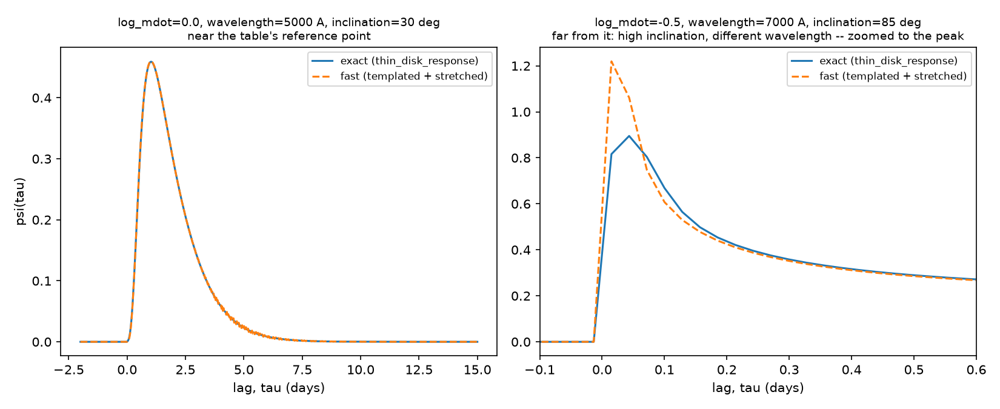
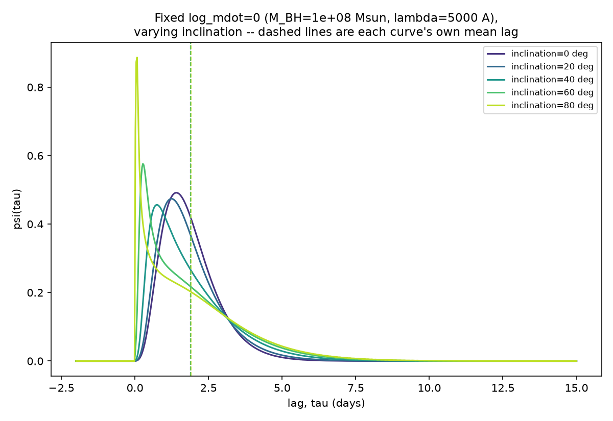
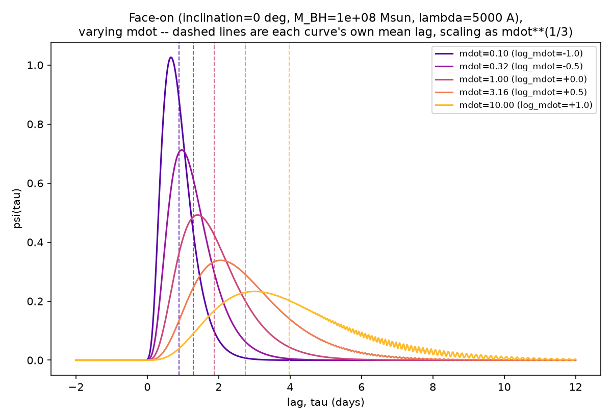

# The thin-disk accretion response function

`forward_model.thin_disk_response` is a physically-motivated alternative to
the default skew-normal `response_function` (see the README's "Swapping the
response function" section and `CLAUDE.md`'s design decisions #5 and #8).
This document works through exactly how it is computed, step by step,
shows the two scaling checks worth seeing on a chart rather than taking on
faith (that inclination reshapes the response without moving its mean
lag, and that the mean lag grows with accretion rate the way thin-disk
theory says it should), and covers the precomputed-template fast path
(`build_thin_disk_response_fast`, section 5) that makes it practical to
use inside NUTS at all.

It is a deterministic, JAX-differentiable adaptation of the Monte-Carlo
disk integrator (the `tfbx`, `tr4visc` and `tr4irad` subroutines) in the
author's PhD-era CREAM Fortran code
([`pycecream`](https://github.com/drds1/pycecream)'s `cream_f90.f90`), not a
line-by-line translation -- the differences from the original Fortran are
called out explicitly below, each one because Monte Carlo sampling and hard
binning are not compatible with a NUTS sampler that needs gradients.

## 1. The physical picture

A thin accretion disk reprocesses the AGN's variable ionising continuum
into thermal (viscous) and reprocessed (irradiation-heated) emission at
every radius `r` and azimuth `phi`. A patch of disk at `(r, phi)` sees the
driving continuum after a light-travel-time delay set by the disk's
geometry, and re-emits at a wavelength set by its own temperature. Summed
over the whole disk, this gives a causal, positive transfer function
`psi(tau)`, the fraction of the reprocessed response arriving with delay
`tau`, exactly what `response_function` also computes, just with the
skew-normal shape swapped out for the real geometry and temperature
physics.

## 2. Temperature profile

Two heating mechanisms are combined, each raised to the 4th power of
temperature (as radiative flux balance requires) and summed:

**Viscous heating** (Shakura-Sunyaev, standard thin-disk theory), with an
inner boundary term that drives the temperature smoothly to zero at the
inner edge `r_in`:

```
T_visc^4(r) = K_visc * (1 - sqrt(r_in / r)) / r**3
```

**Lamppost irradiation** (optional, `include_irradiation=True`), the
disk reprocessing a point-source continuum above the disk plane:

```
T_irr^4(r) = K_irr / r**3
```

(the same radial power as the viscous term, in the flat-disk limit used
here). The two are combined as `T^4(r) = w * T_irr^4(r) + (1-w) *
T_visc^4(r)` for a mixing weight `w` (`irradiation_weight`), or just the
viscous term alone by default.

Both `K_visc` and `K_irr`'s radial *power-law index* (`viscous_slope`,
`irradiation_slope`, default 0.75 each, the standard thin-disk value) are
fixed, not inferred, matching `response_function`'s existing convention of
fixed shape hyperparameters.

**Absolute calibration -- a deliberate departure from the Fortran.** The
Fortran derives `K_visc`/`K_irr` from `G`, the Stefan-Boltzmann constant,
and a physical `Mdot` (itself derived from an Eddington ratio via
`myedrat2mdot`). Doing the same here would give `log_mdot` two different,
incompatible physical meanings depending which response function a band
used. Instead, `thin_disk_response` reuses
`forward_model.lag_scaling(log_mdot, wavelength, M_BH)` -- the same
function `response_function` uses -- to fix a characteristic radius
`r_ref` (in light-days), and Wien's displacement law,
`wavelength * T = b`, to fix the temperature at that radius. This ties the
two response families together: switching a band from `response_function`
to `thin_disk_response` keeps `log_mdot`'s meaning the same. Only the
disk's inner edge (the ISCO, `r_in = 6GM/c**2`) uses real physical
constants directly, since that conversion needs no accretion-rate
calibration at all.

One consequence worth being explicit about: because `r_ref` is only a
*characteristic* radius, not a promise about the resulting response's
actual mean, `thin_disk_response`'s empirical mean lag comes out somewhat
larger than `lag_scaling`'s pivot value (the physical response has real
weight extending well beyond `r_ref`) -- see the worked numbers in
section 5. `response_function`'s mean lag isn't exactly the pivot value
either, for the same reason (a skew-normal's mean isn't its `loc`
parameter once it's skewed). `lag_scaling` fixes the *scale*, not the
*exact* mean, for either response family.

## 3. Delay surface

A patch of disk at radius `r` and azimuth `phi` (measured from the
observer's line of sight projected onto the disk plane) is farther from
the observer, by light-travel time, than the disk's centre by:

```
tau(r, phi) = r * (1 + sin(inclination) * cos(phi))
```

Face-on (`inclination = 0`), every azimuth has the same delay `r`,
whatever the radius, so the whole ring at radius `r` contributes at a
single lag. Inclined, the near side (`cos(phi) = -1`) arrives earlier and
the far side (`cos(phi) = +1`) later than the ring's mean -- this is what
gives the response its inclination-dependent skew. Critically,
`integral_0^{2 pi} cos(phi) dphi = 0`, so **the ring's mean delay is `r`
regardless of inclination**: inclination reshapes the response around a
fixed mean, exactly the same requirement `response_function` satisfies by
construction (`CLAUDE.md` decision #4), except here it falls directly out
of the geometry rather than being imposed on a skew-normal's parameters
after the fact. Section 5 shows this holds numerically, not just in the
idealised integral.

## 4. Response weight and the disk integral

Each `(r, phi)` patch's contribution to `psi(tau)` is weighted by how
strongly its emission responds, in the observing band, to a small heating
perturbation: the Planck function's derivative with respect to
temperature,

```
X = hc / (k * wavelength * T(r))
weight(r) = X**5 * exp(X) / (exp(X) - 1)**2
```

times the disk-plane area element `r dr dphi`. Putting the last three
sections together, the full (idealised, continuous) disk integral is:

```
psi_raw(tau) = integral_{r_in}^{r_max} integral_0^{2 pi}
                   weight(r) * delta(tau - tau(r, phi)) * r dr dphi
```

with `delta` a Dirac delta picking out exactly the `(r, phi)` patches that
land at each `tau`. `psi` is this normalised to unit area on `tau_grid`,
and zeroed for `tau < 0` (automatically satisfied here, since
`tau(r, phi) >= r(1 - sin(inclination)) >= 0` for `inclination <= 90` deg,
unlike the skew-normal, which needs an explicit `tau >= 0` cutoff).

**Deterministic quadrature, not Monte Carlo -- the second deliberate
departure from the Fortran.** The Fortran evaluates this integral by
randomly sampling `(r, phi)` and smoothing the samples onto the output
`tau` grid with a Gaussian kernel; being random, it isn't reproducible or
differentiable the way NUTS needs. `thin_disk_response` instead uses a
*fixed* grid: `n_r` log-spaced radii and `n_phi` evenly-spaced azimuths,
and keeps the Fortran's own idea of a Gaussian-kernel deposit onto
`tau_grid` -- not for the same reason as the Fortran (smoothing over
sampling noise), but because it is what keeps this differentiable at all.
A hard histogram/binning deposit has **exactly zero gradient** with
respect to `log_mdot` and `inclination` almost everywhere, for the same
reason a hard top-hat has zero gradient with respect to its centre (see
`forward_model.tophat_response_free`'s docstring and `CLAUDE.md` decision
#7): autodiff does not backpropagate through which bin a value lands in,
only through smooth functions of it. `tests/test_thin_disk_response.py`
checks this directly with `jax.grad` rather than trusting it by
inspection.

**Quadrature resolution matters more than it looks like it should.** An
initial default of `n_r=40, n_phi=24` passed every numeric test (it is
still causal, still area-normalised, still has non-zero gradients) but
produced a visibly jagged, under-converged curve once actually plotted --
exactly the two figures in this document, which is how the problem was
found. The defaults are now `n_r=50, n_phi=64`, and the figures below use
`n_r=400, n_phi=96` (regenerated by
`scripts/plot_thin_disk_response_scalings.py`) because illustration
quality matters more here than the per-evaluation speed a real fit cares
about. Two things drive how much resolution is actually needed:
inclination=0 removes all `phi`-dependence from `tau(r, phi)` (it equals
`r` for every `phi`), so only `n_r` can smooth a face-on curve; and the
radial grid is log-spaced, so a response sitting at large `r` (high
`mdot`) is resolved far more coarsely, in absolute terms, than one at
small `r`, for the same `n_r`. Raise `n_r`/`n_phi` (or plot a candidate
`psi`) before trusting a fit that pushes `log_mdot` or `inclination` well
outside the ranges checked here.

**A second, related resolution issue: high inclination silently expands
`r_max`.** `r_max` originally came from the largest radius that could
geometrically contribute at `tau_grid[-1]`,
`tau_grid[-1] / (1 - sin(inclination))` -- fine face-on, but at
`inclination=80` degrees this is already ~66x larger than at
`inclination=0` for the same `tau_grid`, and ~100x larger still at
`inclination=89`. Since the radial grid is log-spaced over
`[r_in, r_max]`, the same `n_r` is spread over a domain up to two orders of
magnitude bigger, leaving it far too coarse right where the response
actually has weight -- this, not `n_r` alone, is what was producing visible
waviness in high-inclination curves even at otherwise-generous resolution.
The fix is `r_max_factor` (default 20): `r_max` is capped at
`r_max_factor * tau_ref` (`tau_ref` from :func:`lag_scaling`) regardless of
how large the geometric formula would allow it to grow, since the Planck-
derivative response weight (section 4) decays exponentially in radius and
is already negligible well within 20x `tau_ref` -- confirmed directly
against an uncapped, far-higher-resolution reference at `inclination=80`:
maximum absolute difference ~2e-4, i.e. the cap discards no real signal
while keeping the log-spaced grid concentrated where it matters.

## 5. A precomputed, interpolated fast path for MCMC

`thin_disk_response`'s O(n_r * n_phi * n_tau) disk integral is
considerably more expensive than `response_function`'s closed form, and
NUTS calls a band's response function on every leapfrog step of every
sample -- recomputing the full integral that often is wasteful, since only
`log_mdot` and `inclination` change step to step, not the disk's physics.

`build_thin_disk_response_table` / `build_thin_disk_response_fast`
implement the same fix the author used for this in the PhD-era CREAM
Fortran code: precompute the response once, on a grid of inclinations
(1-5 degree spacing, historically), at one reference accretion rate; then
get any other inclination by interpolating that grid, and any other
accretion rate (or wavelength) by *stretching* the lag axis according to
the `mdot**(1/3)` / `wavelength**(4/3)` scaling `lag_scaling` already uses,
rather than recomputing the disk integral at all:

```python
import echofit.model as model
from echofit.forward_model import build_thin_disk_response_fast

model.response_function = build_thin_disk_response_fast(M_BH=1e8)
```

Concretely, for a given `(log_mdot, wavelength, inclination)`:

1. **Interpolate over inclination** (`jnp.interp`, linear, differentiable
   in `inclination` almost everywhere) against the precomputed template
   family, giving one dimensionless template on the table's own lag axis.
2. **Stretch** that template by `s = lag_scaling(log_mdot, wavelength,
   M_BH) / tau_ref_reference`: evaluate it at `tau_grid / s` and divide by
   `s` to keep the area normalised to 1 under that change of variables.

Both steps are lookups against fixed tables, `O(n_u + n_tau)` rather than
`O(n_r * n_phi * n_tau)` -- confirmed directly at matched resolution
(`n_r=400, n_phi=96`): **~90x faster per call**, with gradients w.r.t.
`log_mdot` and `inclination` still non-zero (checked with `jax.grad`,
including at an inclination *not* on the precomputed grid, the same
discipline used for `thin_disk_response` and
`tophat_response_free`'s gradients elsewhere in this codebase).

**The stretch is an approximation, not identity, and it is honest to say
so.** The disk isn't *exactly* self-similar under it: `r_in` (the ISCO) is
a fixed absolute length, so it doesn't stretch along with everything else,
meaning `r_in / tau_ref` -- and with it, how much the inner boundary
term shapes the response -- genuinely differs between the table's
reference point and wherever a fit actually queries it. In practice this
shows up worst exactly where the response is sharpest: at high
inclination, near the near-zero-lag spike from the disk's near side.



Near the table's own reference point (`log_mdot=0`, `wavelength=5000`
Angstrom), the two curves are visually indistinguishable. Far from it
(`inclination=85` degrees, `wavelength=7000` Angstrom, `log_mdot=-0.5`),
the mean lag still tracks well (both integrate to area 1 by construction,
and the bulk of the curve away from the spike matches closely), but the
spike's *peak height* is off by about 35% -- exactly the kind of
difference a full-width plot hides and only a zoomed one shows, which is
why the right panel above is zoomed to the peak rather than the full
range. If a fit's posterior is expected to live mostly at high inclination
and/or spans multiple bands at very different wavelengths, either build
the table with `reference_wavelength` set closer to the run's own
wavelength(s), or use the exact `thin_disk_response` directly and accept
the slower per-step cost. This tradeoff, not a hidden bug, is exactly what
`tests/test_thin_disk_response_fast.py::test_fast_response_approximation_degrades_away_from_reference`
checks for.

## 6. Verification: the two scaling-law charts

Both figures use a case-study disk with `M_BH = 1e8` solar masses and
`wavelength = 5000` Angstrom (the same pivot values used throughout
`forward_model.py` and the test suite), generated by
`scripts/plot_thin_disk_response_scalings.py`; rerun it to regenerate
these PNGs if `thin_disk_response`'s physics or defaults change.

### Inclination sweep (fixed accretion rate)

`log_mdot = 0` throughout; only inclination varies.



| inclination (deg) | mean lag (days, numerically integrated) |
|---:|---:|
| 0  | 1.8805 |
| 20 | 1.8805 |
| 40 | 1.8805 |
| 60 | 1.8810 |
| 80 | 1.9111 |

The response visibly reshapes (a broad, near-symmetric peak face-on;
an increasingly sharp near-zero-lag spike at high inclination, from the
disk's near side), while the dashed vertical lines, each curve's own
numerically integrated mean lag, sit essentially on top of each other:
flat to 4 significant figures out to 60 degrees, and within 1.6% even at
80 degrees (the extreme case, where the radial integration domain has to
extend much farther to capture the far side's long tail, which is also
where quadrature truncation error is largest). This is section 3's
`integral cos(phi) dphi = 0` argument, confirmed numerically rather than
just algebraically.

### Accretion-rate sweep (fixed face-on inclination)

`inclination = 0` throughout; only `log_mdot` varies.



| log_mdot | mdot | mean lag (days) | `lag_scaling` reference radius (days) |
|---:|---:|---:|---:|
| -1.0 | 0.10 | 0.889 | 0.464 |
| -0.5 | 0.32 | 1.292 | 0.681 |
| +0.0 | 1.00 | 1.881 | 1.000 |
| +0.5 | 3.16 | 2.743 | 1.468 |
| +1.0 | 10.00 | 3.982 | 2.154 |

The mean lag grows monotonically with `mdot`, close to the
`mdot**(1/3)` scaling `lag_scaling` uses (a factor of 4.48x from
`log_mdot=-1` to `+1`, against an ideal `100**(1/3) = 4.64x` -- the small
difference is the inner-boundary and temperature-mixing terms in section 2
bending the pure power law, exactly as they would for a real disk). As
section 2 already flags, the empirical mean lag sits above the
`lag_scaling` reference radius at every `mdot` -- `lag_scaling` fixes the
response's characteristic scale, not its exact mean.

## 7. API summary

```python
from echofit.forward_model import thin_disk_response, build_thin_disk_response_fast
from echofit.responses import get_response
import echofit.model as model

# use the exact disk integral directly
psi = thin_disk_response(tau_grid, log_mdot, wavelength, inclination, M_BH)

# or swap it in for "physical"-mode bands (see CLAUDE.md decision #5)
model.response_function = get_response("thin_disk")

# or use the fast, precomputed-template approximation (section 5) instead,
# for a real fit where per-step cost matters
model.response_function = build_thin_disk_response_fast(M_BH=1e8)
```

See `thin_disk_response`'s own docstring in `forward_model.py` for the
full parameter list (`viscous_slope`, `include_irradiation`,
`irradiation_slope`, `irradiation_weight`, `n_r`, `n_phi`, `r_max_factor`,
`smoothing_days`), `build_thin_disk_response_table`'s docstring for the
fast path's own parameters (`incl_grid`, `reference_log_mdot`,
`reference_wavelength`, `u_max_factor`, `n_u`), and `README.md`'s
"Swapping the response function" section for how these relate to the
default skew-normal and to `echofit/responses.py`'s registry.
